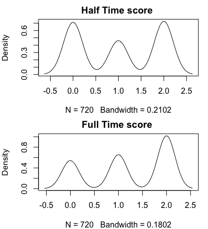

### Reuired Libaries

```{ echo=FALSE}
require(XML)
require(RCurl)
require(plyr)
require(gtools)
```

### Data from football statistics website of spanish league 2014-15 & 2015-16


```{ echo=FALSE}
fileURL <- "http://www.football-data.co.uk/mmz4281/1516/SP1.csv?accessType=DOWNLOAD"
download.file(fileURL, destfile = "./fbData.csv", method = "curl")
fileURLTwo <- "http://www.football-data.co.uk/mmz4281/1415/SP1.csv?accessType=DOWNLOAD"
download.file(fileURLTwo, destfile = "./fbDataTwo.csv", method = "curl")
```
### Saving the date of the extraction date
```{echo=FALSE}
dateDownloaded <- date()
dateDownloaded
```

### Open the data after been saved as csv file in my working directory

```{echo=FALSE}
footballData <- read.csv("./fbData.csv", sep = ",", header=TRUE)
footballDataTwo <- read.csv("./fbDataTwo.csv", sep = ",", header=TRUE)
```
### Subset which cutting the unnessecery cols 

```{echo=FALSE}
footballData <- subset(footballData, select = -c(B365H : BbAvAHA))
footballDataTwo <- subset(footballDataTwo, select = -c(B365H : BbAvAHA))
```

### Bind the data to one data frame
```{echo=FALSE}
total <- rbind(footballData,footballDataTwo)
```

### creating data frame with only teams name
```{echo=FALSE}
teamName <- subset(footballData,select=c(HomeTeam) )
teamNameUni <- unique(teamName)
head(teamNameUni)
```

### adding cols to list games by zero -> tie , one -> away lead , two -> home lead
```{echo=FALSE}
listGames <- subset(total,select=c(HomeTeam,AwayTeam,HTHG,FTHG,HTAG,FTAG))
listH <- listGames$HTHG - listGames$HTAG
listF <- listGames$FTHG - listGames$FTAG
listGames <- cbind(listGames,listH,listF)
colH <- ifelse(listGames$listH<0, 1, ifelse(listGames$listH>0, 2, 0))
colF <- ifelse(listGames$listF<0, 1, ifelse(listGames$listF>0, 2, 0))
listGames <- cbind(listGames,colH,colF)
```

### Show the density of half time score and full time score by home and away
```{echo=FALSE}
par(mfrow=c(2,1),mar=c(4,4,2,1))
d <- density(listGames$colH)
plot(d,main = "Half Time score ")
d <- density(listGames$colF)
plot(d,main = "Full Time score ")
```

image:  

##Conclusions
1. The home team usually wins the game, you can see in the density graph of final results that the density on home team (2) is higher.
2. Mostly in Halftime score , the home team leads and symmetrically have a similar chance of a tie. 
This implies that the chances of the away team to lead in first half are significantly lower.

Summary: Home teams have more confidence during the game. Away team getting tie result on the first half is a good result for the next half of the game.
